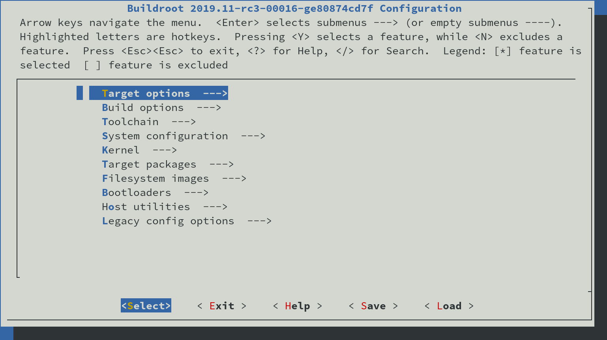

# Building the OS image

Buildroot is a fantastic tool all centered on the use of make.
It automates the fetch of all the packages, it downloads as well
the Linux kernel and the toolchain for the cross compilation.

For this project a script has been made to simplify the use of Buildroot.
The following pages explain how to use it and how to use Buildroot build
for cross compilation.

## Table of content

* [compile_buildroot.sh](compile_buildroot_script.md)
* [Cross compilation](crosscompiler.md)
