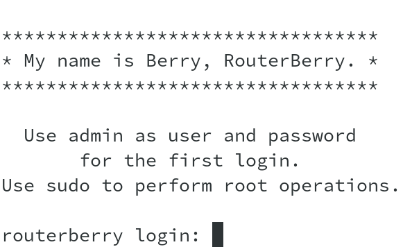

# General documentation of the OS

## Users

You can login into the system with user `admin` and password `admin`.
Think about changing the password. You can use the command `passwd admin`
to do it.

The account root is disabled. You can't login as root but you can become
root using sudo: `sudo su`.

`admin` is part of the group `sudo`. You can perform privileged operations
using sudo. You won't be asked for the password.

If needed you can add new users with the command `adduser`.

## Aliases

There are some aliases defined for the user `admin`.

- `firewall`: shows the current configuration of iptables. It displays
  the *filter*  and *nat* tables.
  This is a shortcut for `sudo /etc/init.d/S45firewall status`.
- `leases`: shows the IP addresses given by the DHCP server. The leases
  are stored in the file */var/lib/misc/dnsmasq.leases*.

## Tools

You can call `show_config` command to print the current configuration of
the network. It will print all the configuration files required to setup
the network topology. For more details go to the [network](networking.md)
section of the documentation.

## Personalize the boot process

You can disable or enable processes at boot time by changing the execution
flag of the relative script in */etc/init.d/*.

For example, to disable Grafana at boot time execute
`sudo chmod -x /etc/init.d/S93grafana`.

To re-enable it `sudo chmod +x /etc/init.d/S93grafana`.

For the symbolic links such as `S90influxdb` and `S91telegraf` you have
to change the permissions to the original files:
`/usr/lib/influxdb/scripts/init.sh` and `/usr/lib/telegraf/scripts/init.sh`.
