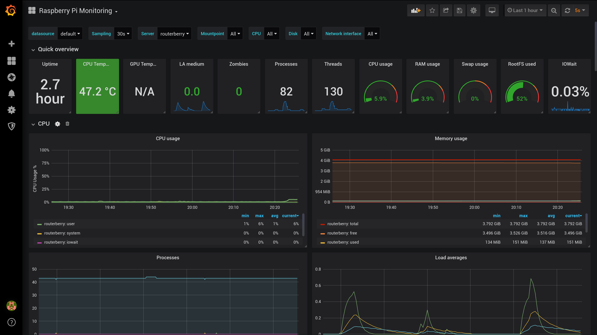

# Web dashboard for internal monitoring

This Linux distribution comes with a Web UI that displays info about
the Raspberry itself.

The monitoring platform is made of 3 components. The time series
database ([InfluxDB](https://www.influxdata.com/products/influxdb-overview/))
which stores the metrics, the metrics collector
([Telegraf](https://www.influxdata.com/time-series-platform/telegraf/))
which periodically gets the value from the system and pushes them in the DB,
and finally the Web UI ([Grafana](https://grafana.com/grafana/)).

Grafana is a powerful tool you can use to display data coming from a
various number of different sources.
Anyone can prepare a dashboard and share it on the official portal
[link here](https://grafana.com/grafana/dashboards)). For this project
the best choice was the
[Raspberry Pi Monitoring](https://grafana.com/grafana/dashboards/10578).
With some small modifications on what Telegraf has to collect from the
system this premade dashboard shows all the needful information for
the monitoring of the Raspberry.

You can access the dashboard by connecting to the IP of the Raspberry
and port 3000. So default is: <http://192.168.1.1:3000/>.

Use "admin" as user and password. You'll be prompt to change it at the
first access.

## Configuration

### InfluxDB

InfluxDB has a single configuration file: */etc/influxdb/influxdb.conf*.

The default listening port is 8086 over HTTP. The authentication is
disabled and can be enabled by following
[this guide](https://docs.influxdata.com/influxdb/v1.7/administration/authentication_and_authorization/).

### Telegraf

Telegraf configuration is in */etc/telegraf/*. It consists of a main config
file (*telegraf.conf*) and other custom files under *telegraf.d/*.

The focal sections of Telegraf configuration are the "outputs" plugins
(where to write the collected data) and the "inputs" section (where to
look for the metrics).

For this system the default configuration requires just a small extension.
Some additional plugins are enabled by the file *telegraf.d/raspi.conf*.

### Grafana

Some of the Grafana configurations are in the file
*/usr/share/grafana/conf/defaults.ini* such as the HTTP server definition
and the internal folders location. But for what concerns the functional
configuration of Grafana it is all stored in a SQLite database under the
folder */usr/share/grafana/data/*. So it's not very easy to change it from
files. Fortunately Grafana allows to load at boot time config fragments
using the concept of
[provisioning](https://grafana.com/docs/grafana/latest/administration/provisioning/).

Through this mechanism the InfluxDB datasource and the Raspberry dashboard
are automatically configured.

The InfluxDB datasource is configured in
*/usr/share/grafana/conf/provisioning/datasources/influxdb.yaml*.

The provisioning of the dashboard is configured in
*/usr/share/grafana/conf/provisioning/dashboards/raspberry.yaml*.
The definition of the dashboard itself is the file
*/usr/share/grafana/conf/dashboards/raspberry.json*.

## Logs

- InfluxDB log file is */var/log/influxdb/influxd.log*
- Telegraf log file is */var/log/telegraf/telegraf.log*
- Grafana log file is */usr/share/grafana/data/log/grafana.log*
