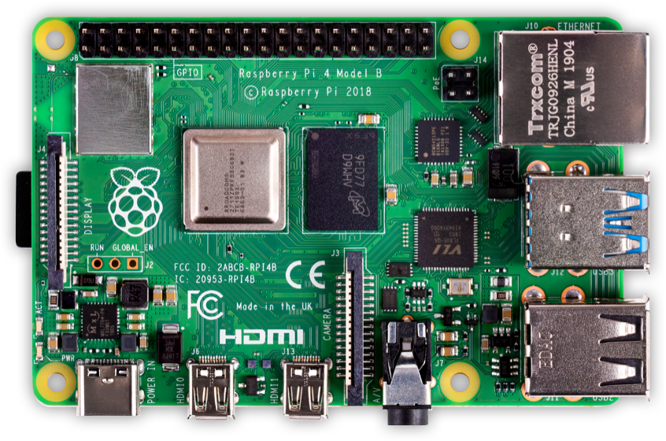

# Why this project?

## Rationale

Boards like the Raspberry Pi or the ODROID are becoming more and
more popular thanks to their computational power.

Nowadays they are powerful enough to satisfy the needs of most of
the users. It's very straightforward to download and install a
GNU/Linux distribution and to start using the system for browsing
or video playback.

*Straightforward means boring...*

I've always been fascinated by the operating systems of network
devices such as routers.
Their sturdy filesystem let you unplug the power at any time
without any damage. If for some reason the configuration gets
corrupted you can simply reset the device to restore the
*factory parameters* and you are again good to go.

**How to achieve this?**

In one word: *overlaying*

The root filesystem is made of the union of two or more filesystems
(or more in general folders). We will call those filesystem **layers**.
One layer is made **read only** and it contains a basic linux installation.
A full root scheleton with all the binaries, config files and libraries.
This by itself works and makes the device boot.
All the customization are stored in another **read write** layer.
This second layer can be in memory (meaning all the changes are lost
after every power cycle) or on a different block device. The drawback
of this second choice is that it can get corrupted if you unplug the
power while the system is writing here. In this case you can always
wipe the second layer to go back to the default configuration.

## Project description

The idea of this project is to play with the overlay filesystem
applying it on a real use case.
The goal is to transform the Raspberry Pi 4 in a router with the
following features:

- Isolation between two distinct networks with a NAT and a firewall
- Ability to easily configure the topology (e.g. NAT or bridge)
- A basic configuration that let users easily access to the system
  to perform the initial configuration

The basic configuration is done by setting the integrated wireless
network interface of the Raspberry Pi 4 as a hosted mode so that
other devices can connect to it.
Once connected a user can ssh to the Raspberry to launch the
config tool and set up the desired configuration.

Note that at least two network devices are required. They can be
either the integrated WiFi and Ethernet or another USB device.

This project doesn't start from a premade GNU/Linux distribution,
but rather it uses **Buildroot** to assemble an entire custom
operating system by picking up by hand EVERYTHING. Starting from
the toolchain for the cross compilation to the way to assemble
the root filesystem scheleton.

## Milestones

This project is developed with some milestone in mind.

1. Basic GNU/Linux OS made starting from the default configuration
   of Buildroot
2. GNU/Linux OS with the basic routing configuration (DHCP, Wireless
   access point)
3. Same image as previous step, but with tools to customize the
   configuration at runtime
4. Filesystem overlaying to make the changes appear only on the
   upper overlay RW filesystem
5. (Optional) basic driver for external GPIO interface to perform
   some basic operations such as reboot, factory reset, Wireless
   ON/OFF
